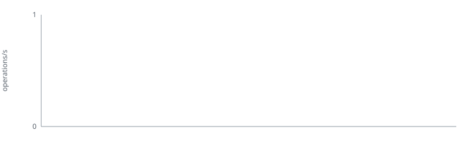

# Benchmark history

This report is generated by `scripts/update_benches.py`. Each pull request retains
one result, which is replaced when that pull request's benchmarks run again.

| Pull request | Commit | Recorded (UTC) | Builder operations/s | Binary bytes |
| ---: | :--- | :--- | ---: | ---: |
| — | — | — | — | — |
