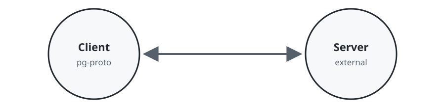
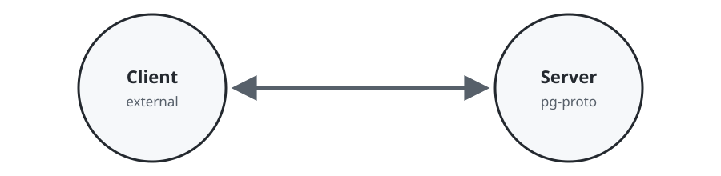
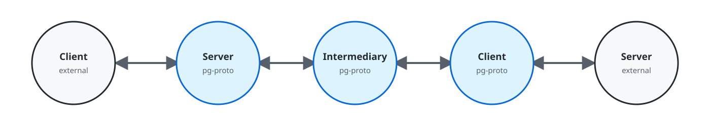

# pg-proto

[](https://github.com/freshtonic/pg-proto/actions/workflows/ci.yml)
[](https://docs.rs/pg-proto)
[](https://crates.io/crates/pg-proto)
[](https://blog.rust-lang.org/2025/06/26/Rust-1.88.0/)
[](https://github.com/freshtonic/pg-proto/blob/main/LICENSE)

`pg-proto` is an asynchronous Rust implementation of the PostgreSQL
frontend/backend wire protocol designed for proxies, poolers, gateways, drivers,
and protocol-aware test infrastructure.

Its distinguishing feature is a builder-only facade over PostgreSQL's typed
connection state machine. `Client::builder()`, `Server::builder()`, and
`Intermediary::builder()` require explicit transport-security, authentication,
middleware, and routing policy before they establish operational connections.
The internal protocol typestates prevent illegal sequencing without exposing
the implementation graph as application API.

Most PostgreSQL protocol libraries decode messages but retain the session phase
in a runtime enum. `pg-proto` is useful when protocol correctness is part of the
architecture rather than merely an implementation detail: the legal next
operations are visible in function signatures, illegal compositions are rejected
at compile time, and proxy policy can still inspect, replace, or reject complete
typed messages.

## Modes of operation

`pg-proto` supports three role-composition archetypes. “External” means a real
PostgreSQL database, an established driver, or any other participant that speaks
the PostgreSQL frontend/backend wire protocol.

### Client role



`pg-proto` initiates the connection and acts as the protocol client. The external
server is commonly PostgreSQL itself, but may be any compatible server.

### Server role



An external client initiates the connection and `pg-proto` acts as the protocol
server. This mode suits PostgreSQL-compatible services, test backends, recorders,
and protocol conformance tools.

### Intermediary role



`pg-proto` terminates both protocol roles around an intermediary: its server side
accepts the external client, while its client side establishes an independent
connection to the external server. Middleware can inspect, edit, replace, or
reject messages in either direction. Startup and authenticated routing policies
can select or refine the destination for sharding, tenancy isolation, regional
routing, or other application-owned placement decisions.

## What it provides

- Direction-parameterised frontend and backend codecs. Ambiguous tags such as
  `S` and `E` cannot be decoded in the wrong direction.
- Typed pre-startup handling for `SSLRequest`, `GSSENCRequest`, `CancelRequest`,
  and `StartupMessage`, including transport-changing rustls upgrades.
- A plain/client-TLS/server-TLS network stream, configurable TCP socket options,
  and outbound connection retry with capped exponential backoff.
- Independent client-facing and upstream authentication sessions, including
  cleartext, MD5, SCRAM-SHA-256, and SCRAM-SHA-256-PLUS with channel binding.
- Simple and extended query sessions, pipelining, error draining, function calls,
  COPY IN/OUT/BOTH, and physical replication framing.
- Lossless, reconstructable `Parse`, `Bind`, `Describe`, `Execute`,
  `RowDescription`, and `DataRow` values for SQL and result rewriting.
- A demultiplexer for asynchronous notices, notifications, and parameter status
  updates without polluting the causal session type.
- Positionally tagged notices and transaction/parameter evidence for pooling
  decisions.
- Connection-branded prepared statements and portals with name rewriting.
- Exact typestate erasure and checked re-entry at storage and pool boundaries.
- A protocol grammar macro which emits typestates, their duals, a runtime FSM for
  differential testing, and railroad diagrams embedded in rustdoc.

The crate owns protocol representation and ordering. Applications retain control
of listeners, credentials, authorisation, SQL transformation, routing, pooling,
cancellation storage, telemetry, and failure policy.

## Why use it?

PostgreSQL infrastructure tends to fail at phase boundaries rather than while
decoding an individual frame. A pooler may return a connection while it is still
in a transaction, a proxy may forward `Query` while a COPY exchange is active,
or an extended-query error path may forget to discard messages until `Sync`.
Typestate makes these transitions explicit and turns many such bugs into type
errors.

The phase index is orthogonal to connection cleanliness. A connection can be
protocol-ready but unsuitable for unconditional pool release because of an open
transaction, changed GUC, prepared statement, portal, `LISTEN`, or advisory lock.
Operational connections return explicit state evidence and preserve caller-owned
state until teardown.

## What can be built with it?

The [bounded intermediary pipeline example](examples/intermediary_pipeline.rs)
shows ordered forwarding, local interception, and backpressure without proxy-owned
message queues.

- A TLS-terminating PostgreSQL proxy which authenticates each side independently
  and inspects plaintext SQL and result rows.
- A transaction or session pooler whose release policy consumes explicit
  protocol and cleanliness evidence.
- A SQL firewall, audit gateway, query rewriter, or column-encryption proxy.
- A sharding/router layer which rewrites prepared-statement and portal names.
- A logical or physical replication relay with typed COPY-BOTH half-closes.
- A PostgreSQL-compatible server, mock backend, recorder, replay tool, or protocol
  conformance harness.
- A driver or administrative client which benefits from compile-time sequencing.

## Security choices come first

Every role builder requires explicit TLS and authentication policy. The short
examples below deliberately use **plaintext** (`ClientTlsPolicy::Disabled` and
`ServerTlsPolicy::Disabled`) and **unverified trust authentication**
(`TrustClientAuthentication` and `TrustServerAuthentication`) so that their
insecure posture is visible in code. They are suitable for a protected local
development network, not an Internet-facing production deployment.

For production, use `ClientTlsPolicy::libpq` with `SslMode::VerifyFull` and an
application-owned reloadable `ClientTlsProvider`; use `ServerTlsPolicy::Required`
with an application-owned `ServerIdentityProvider`. Supply application-defined
`ClientAuthentication` and `ServerAuthenticationProvider` implementations that
return typed identity evidence. `pg-proto` orchestrates the protocol but remains
policy-neutral: it does not store credentials, authorise identities, choose
authentication mechanisms, or provision certificates.

The default one-mebibyte frame limits are conservative. Raising a limit or
calling `ProtocolLimits::without_frame_limit` is an explicit resource-exhaustion
downgrade; production services should instead choose the smallest limit their
workload needs. Likewise, `SslMode::Allow`, `Prefer`, `Require`, and `VerifyCa`
provide less assurance than `VerifyFull`, and must be selected deliberately.

## Client: connect to PostgreSQL

Build one reusable upstream-facing component, then establish operational
connections with caller-owned state and per-call startup parameters.

```rust,no_run
use pg_proto::{
    Client, ClientTlsPolicy, ConnectTarget, StartupParameters,
    TrustClientAuthentication,
};

#[tokio::main]
async fn main() -> Result<(), Box<dyn std::error::Error>> {
    let client = Client::builder()
        .connector(|target| {
            let address = target.name().to_owned();
            async move { tokio::net::TcpStream::connect(address).await }
        })
        // Development-only: plaintext transport and no credential exchange.
        .tls(ClientTlsPolicy::Disabled)
        .authentication(TrustClientAuthentication)
        .startup_parameters(StartupParameters::new("application"))
        .build()?;

    let connection = client
        .connect(
            ConnectTarget::new("127.0.0.1:5432"),
            StartupParameters::default().database("postgres"),
            Vec::<String>::new(),
        )
        .await?;
    let (_transport, state, _middleware, context) = connection.into_parts();
    assert!(state.is_empty());
    assert_eq!(context.target().name(), "127.0.0.1:5432");
    Ok(())
}
```

## Server: accept PostgreSQL clients

The server builder owns reusable client-facing policy. The application owns the
listener, peer metadata, per-connection state, credentials, and authorisation.

```rust,no_run
use pg_proto::{Server, ServerAccept, ServerTlsPolicy, TrustServerAuthentication};

#[tokio::main]
async fn main() -> Result<(), Box<dyn std::error::Error>> {
    let server = Server::builder()
        // Development-only: clients are neither encrypted nor authenticated.
        .tls(ServerTlsPolicy::Disabled)
        .authentication(TrustServerAuthentication)
        .build()?;
    let listener = tokio::net::TcpListener::bind("127.0.0.1:6432").await?;
    let (transport, peer) = listener.accept().await?;

    match server.accept(transport, peer, Vec::<String>::new()).await? {
        ServerAccept::Session(connection) => {
            println!("accepted user {:?}", connection.startup().parameters.get(b"user".as_slice()));
            let (_transport, _state, _middleware, _context) = connection.teardown();
        }
        ServerAccept::Cancellation(cancellation) => {
            println!("cancel process {}", cancellation.request().process_id());
        }
    }
    Ok(())
}
```

## Intermediary: compose both roles

An intermediary takes complete server and client components. Startup routing,
authenticated routing, cancellation storage, middleware, and failure disclosure
remain explicit application policies.

```rust,no_run
use std::{convert::Infallible, future::Future, pin::Pin};
use pg_proto::{
    CancellationPolicy, Client, ClientTlsPolicy, ConnectTarget, InitialServerContext,
    Intermediary, Server, ServerTlsPolicy, StartupParameters, StartupRouteResolver,
    TrustClientAuthentication, TrustServerAuthentication,
};

struct Route;
impl<Peer> StartupRouteResolver<Peer> for Route {
    type Error = Infallible;
    fn resolve<'a>(
        &'a self,
        _: StartupParameters,
        _: InitialServerContext<'a, Peer>,
    ) -> Pin<Box<dyn Future<Output = Result<ConnectTarget, Self::Error>> + 'a>> {
        Box::pin(async { Ok(ConnectTarget::new("127.0.0.1:5432")) })
    }
}

#[tokio::main]
async fn main() -> Result<(), Box<dyn std::error::Error>> {
    let server = Server::builder()
        .tls(ServerTlsPolicy::Disabled) // Development-only plaintext/trust.
        .authentication(TrustServerAuthentication)
        .build()?;
    let client = Client::builder()
        .connector(|target| {
            let address = target.name().to_owned();
            async move { tokio::net::TcpStream::connect(address).await }
        })
        .tls(ClientTlsPolicy::Disabled) // Development-only plaintext/trust.
        .authentication(TrustClientAuthentication)
        .build()?;
    let intermediary = Intermediary::builder()
        .server(server)
        .client(client)
        .startup_resolver(Route)
        .cancellation(CancellationPolicy::Reject)
        .build()?;

    let listener = tokio::net::TcpListener::bind("127.0.0.1:6432").await?;
    let (transport, peer) = listener.accept().await?;
    let mut connection = Box::pin(intermediary.accept(transport, peer, ()))
        .await?
        .into_session();
    while !matches!(
        connection.forward_next().await?,
        pg_proto::ForwardedMessage::Frontend(pg_proto::FrontendMessage::Terminate)
    ) {}
    Ok(())
}
```

## Stateful message middleware

A proxy can inspect or replace owned frontend and backend messages through
builder middleware. Each accepted connection gets a fresh handler with mutable
access to the application-supplied per-connection state. Repeated `.middleware`
calls compose stages in declaration order.

```rust
use pg_proto::{
    Client, ClientConnectionContext, ClientInitialContext, ClientMiddleware, ClientTlsPolicy,
    FrontendMessage, TrustClientAuthentication,
};

#[derive(Clone, Copy)]
struct CountQueries;

impl ClientMiddleware<usize, ClientConnectionContext> for CountQueries {
    fn frontend(
        &mut self,
        _context: &ClientConnectionContext,
        count: &mut usize,
        message: FrontendMessage,
    ) -> FrontendMessage {
        if matches!(message, FrontendMessage::Query(_)) {
            *count += 1;
        }
        message
    }
}

let _client = Client::builder()
    .connector(|_| async { Ok::<_, std::io::Error>(()) })
    .tls(ClientTlsPolicy::Disabled)
    .authentication(TrustClientAuthentication)
    .middleware(|_: &ClientInitialContext| CountQueries)
    .build()?;
# Ok::<(), pg_proto::BuildError>(())
```

For a complete networked example, see the TLS-terminating
[`SQL logging proxy`](examples/sql_logging_proxy/README.md). The companion
[`protocol logging proxy`](examples/protocol_logging_proxy/README.md) prints every
decoded message in both directions. More focused examples live in the
[`examples/`](examples/) directory, including message rewriting and the neutral
proxy composition boundary.

## Rustdoc entry point

The [crate overview](https://docs.rs/pg-proto/latest/pg_proto/) documents the
complete root facade: role builders, nested security configuration, middleware,
operational connection types, and root message vocabulary.

Build the same documentation locally with:

```bash
cargo doc --workspace --no-deps --open
```

## Supported PostgreSQL versions

PostgreSQL **14, 15, 16, 17, and 18** are supported. Each version runs the same
live suite against its official Alpine image. PostgreSQL 14–17 negotiate a
requested protocol 3.2 startup down to 3.0; PostgreSQL 18 reports protocol 3.2.
Both behaviours are covered explicitly.

Run a selected version locally with a Docker-compatible runtime:

```bash
PG_PROTO_POSTGRES_VERSION=18 \
  cargo test --lib internal_tests::postgres_container -- --ignored
```

See [`SUPPORTED_VERSIONS.md`](SUPPORTED_VERSIONS.md) for the tested protocol
matrix.

## Message support

The checklist below follows PostgreSQL's official
[message-format catalogue](https://www.postgresql.org/docs/current/protocol-message-formats.html)
and groups messages by protocol phase and sender. A checked item has a typed,
lossless representation reachable through the public facade and can be decoded
and reconstructed; contextual aliases which share a wire tag name the public
`pg-proto` representation in parentheses. An unchecked item would identify a
known PostgreSQL protocol message which is not yet supported. There are currently
no unchecked protocol-version-3 message types.

- [x] Pre-startup and startup
  - [x] Frontend
    - [x] `SSLRequest`
    - [x] `GSSENCRequest` (`PreStartupMessage::GssEncRequest`)
    - [x] `StartupMessage` (`PreStartupMessage::Startup`)
    - [x] `CancelRequest` (`PreStartupMessage::CancelRequest`)
  - [x] Backend transport negotiation replies
    - [x] SSL accepted (`S`), rejected (`N`), and legacy error (`E`)
    - [x] GSS encryption accepted (`G`) and rejected (`N`)
- [x] Authentication and startup completion
  - [x] Frontend
    - [x] `PasswordMessage` (`FrontendMessage::PasswordResponse`)
    - [x] `GSSResponse` (`FrontendMessage::PasswordResponse`)
    - [x] `SASLInitialResponse` (`FrontendMessage::PasswordResponse`)
    - [x] `SASLResponse` (`FrontendMessage::PasswordResponse`)
  - [x] Backend
    - [x] `AuthenticationOk` (`Authentication::Ok`)
    - [x] `AuthenticationKerberosV5` (`Authentication::KerberosV5`)
    - [x] `AuthenticationCleartextPassword` (`Authentication::CleartextPassword`)
    - [x] `AuthenticationMD5Password` (`Authentication::Md5Password`)
    - [x] `AuthenticationGSS` (`Authentication::Gss`)
    - [x] `AuthenticationGSSContinue` (`Authentication::GssContinue`)
    - [x] `AuthenticationSSPI` (`Authentication::Sspi`)
    - [x] `AuthenticationSASL` (`Authentication::Sasl`)
    - [x] `AuthenticationSASLContinue` (`Authentication::SaslContinue`)
    - [x] `AuthenticationSASLFinal` (`Authentication::SaslFinal`)
    - [x] `BackendKeyData`
    - [x] `NegotiateProtocolVersion`
    - [x] `ParameterStatus`
    - [x] `ReadyForQuery`
    - [x] `ErrorResponse`
- [x] Simple query and legacy function calls
  - [x] Frontend
    - [x] `Query`
    - [x] `FunctionCall`
  - [x] Backend
    - [x] `RowDescription`
    - [x] `DataRow`
    - [x] `CommandComplete`
    - [x] `EmptyQueryResponse`
    - [x] `FunctionCallResponse`
    - [x] `ReadyForQuery`
    - [x] `ErrorResponse`
- [x] Extended query
  - [x] Frontend
    - [x] `Parse`
    - [x] `Bind`
    - [x] `Describe`
    - [x] `Execute`
    - [x] `Close`
    - [x] `Flush`
    - [x] `Sync`
  - [x] Backend
    - [x] `ParseComplete`
    - [x] `BindComplete`
    - [x] `CloseComplete`
    - [x] `ParameterDescription`
    - [x] `RowDescription`
    - [x] `NoData`
    - [x] `DataRow`
    - [x] `PortalSuspended`
    - [x] `CommandComplete`
    - [x] `EmptyQueryResponse`
    - [x] `ReadyForQuery`
    - [x] `ErrorResponse`
- [x] `COPY` and replication streaming
  - [x] Frontend
    - [x] `CopyData`
    - [x] `CopyDone`
    - [x] `CopyFail`
  - [x] Backend
    - [x] `CopyInResponse`
    - [x] `CopyOutResponse`
    - [x] `CopyBothResponse`
    - [x] `CopyData`
    - [x] `CopyDone`
    - [x] `CommandComplete`
    - [x] `ReadyForQuery`
    - [x] `ErrorResponse`
- [x] Asynchronous backend messages
  - [x] `NoticeResponse`
  - [x] `NotificationResponse`
  - [x] `ParameterStatus`
- [x] Session termination and out-of-band cancellation
  - [x] Frontend `Terminate`
  - [x] Frontend pre-startup `CancelRequest`

Authentication mechanism engines and encrypted transports are separate from
message support. In particular, Kerberos V5, GSSAPI, and SSPI messages are fully
represented, while applications must supply their platform credential engines;
applications must also supply a production GSS encryption transport adapter.

## PostgreSQL wire protocol documentation

The primary reference for the wire protocol is PostgreSQL's official
[Frontend/Backend Protocol documentation](https://www.postgresql.org/docs/current/protocol.html).
Its key sections are:

- [Message flow](https://www.postgresql.org/docs/current/protocol-flow.html) —
  connections, authentication, queries, `COPY`, and cancellation.
- [Message formats](https://www.postgresql.org/docs/current/protocol-message-formats.html) —
  byte-level packet layouts.
- [Message data types](https://www.postgresql.org/docs/current/protocol-message-types.html) —
  integer, string, and byte encodings.
- [SASL/SCRAM authentication](https://www.postgresql.org/docs/current/sasl-authentication.html) —
  modern password authentication.

> **Compatibility note:** PostgreSQL 18 introduced protocol 3.2, but most
> clients still negotiate version 3.0 for compatibility. Read the documentation
> for the oldest PostgreSQL version you intend to support, and use an
> established driver's source code as an executable reference.

## Known limitations

- The API is pre-1.0 and may change as it is integrated into a production proxy.
- Kerberos V5, GSSAPI, SSPI, and GSS token exchanges are represented by the
  protocol API, but the crate does not ship platform credential-provider engines.
  GSS encryption negotiation is modelled; a production GSSENC transport adapter
  remains application work.
- Pool scheduling, routing, SQL parsing, policy, credential storage, certificate
  provisioning, and cancellation-key persistence are intentionally not included.
- Rust is affine rather than linear: callers can deliberately abandon an
  operational connection by dropping it.
- Unknown future PostgreSQL message tags are rejected by the typed codec until
  their direction and semantics are added.
- Formal multiparty verification is not provided. Client and server roles are
  dual generated APIs with differential runtime-FSM testing, not a machine-checked
  proof of a complete three-party proxy.

Security assumptions and downstream responsibilities are documented in
[`SECURITY.md`](SECURITY.md). The audited proxy capability boundary is in
[`PROXY_COMPATIBILITY.md`](PROXY_COMPATIBILITY.md), and migration from a
runtime-enum implementation is covered by [`MIGRATION.md`](MIGRATION.md).
Contribution instructions and community expectations are in
[`CONTRIBUTING.md`](CONTRIBUTING.md) and
[`CODE_OF_CONDUCT.md`](CODE_OF_CONDUCT.md).

## Verification

The ordinary suite includes unit, fixture, property-style differential,
compile-fail, and documentation tests:

```bash
cargo test --workspace
```

Live PostgreSQL tests require a Docker-compatible runtime:

```bash
cargo test --lib internal_tests::postgres_container -- --ignored
```

## Licence

Licensed under the [MIT License](https://github.com/freshtonic/pg-proto/blob/main/LICENSE).
